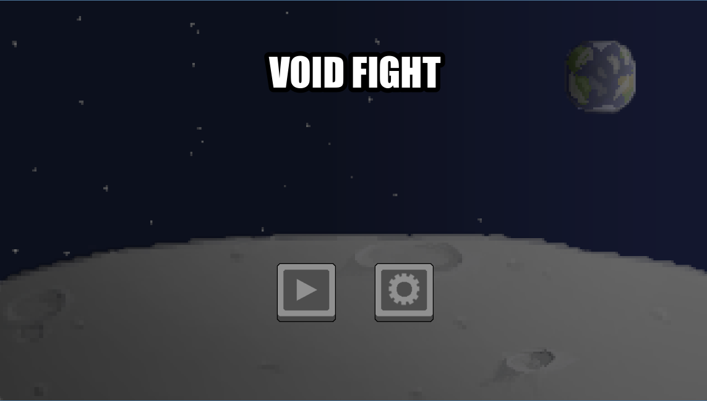
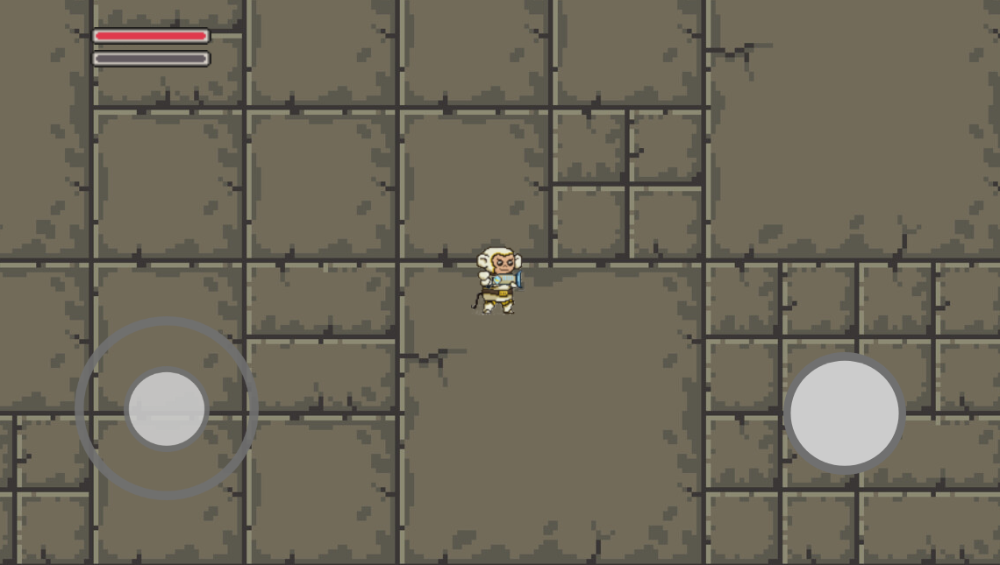

# Void Fight: The Godot Mini-Game
This demo is a simple pixel art 2D platformer built on the Godot Engine. 

Step into the boots of an elite astronaut. Your mission is simple: destroy the aliens. Master your movement and fire control to clear the map of every hostile entity in this exciting mini-shooter.

Engine: Godot Engine v4.5 (or later)

Language: C#

Platforms: Mobile.
### Screenshots

### 🎮 Controls (Mobile)

This game is designed for touch input. All controls are displayed directly on the screen (HUD).

| Action | Control Element | Description |
| :--- | :--- | :--- |
| **Movement** | Virtual Joystick (Left side) | Drag the joystick to move the astronaut in any direction across the map. |
| **Shoot / Attack** | Fire Button (Right side) | Tap the dedicated button to fire the blaster and destroy aliens. |

### Credits 

This project was built by the following contributors:

* [https://github.com/tallchildvi]
* [https://github.com/ovaleriankaa]
* [https://github.com/DavydenkoV07]
* [https://github.com/VladyslavYan0v]
* [https://github.com/RostyslavBoichuk]

  
